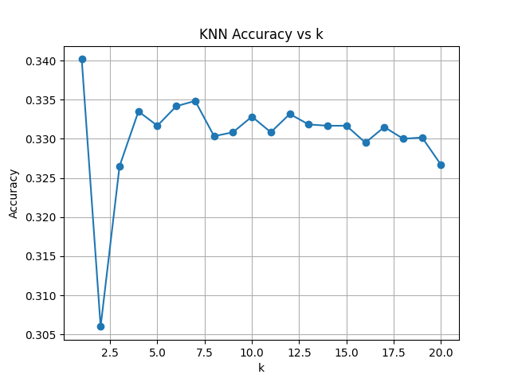

# CIFAR-10 Image Classification

## Overview
This project implements and compares two machine learning models for image classification on the CIFAR-10 dataset:
- K-Nearest Neighbors (KNN)
- Multilayer Perceptron (MLP)

The CIFAR-10 dataset consists of 60,000 32x32 color images across 10 classes, with 6,000 images per class.

## Project Structure
- `read_cifar.py`: Functions to load and preprocess the CIFAR-10 dataset
- `knn.py`: Implementation of the K-Nearest Neighbors algorithm
- `mlp.py`: Implementation of the Multilayer Perceptron neural network
- `test.ipynb`: Jupyter notebook for testing and visualizing the models
- `results/`: Directory containing performance plots

## Results
The project compares the performance of both models:

### KNN Model
- Tested with k values ranging from 1 to 20
- Achieved an accuracy of approximately 33.5%
- Best performance found at k=5 (excluding k=1)

### MLP Model
- Implemented with a hidden layer size of 1024 neurons
- Trained for 100 epochs with a learning rate of 0.01
- Achieved a test accuracy of about 21%

## Conclusion
The KNN implementation outperformed the MLP model for this particular dataset and configuration, achieving an accuracy of 33.5% compared to the MLP's 21%.

## Usage
To reproduce the results:
1. Ensure you have the CIFAR-10 dataset in a `data` directory
2. Run the Jupyter notebook `test.ipynb` to train and evaluate both models
3. View the generated plots in the `results` directory

## Requirements
- Python 3
- NumPy
- Matplotlib
- Pickle (for reading CIFAR-10 data)

Stevan Le Stanc